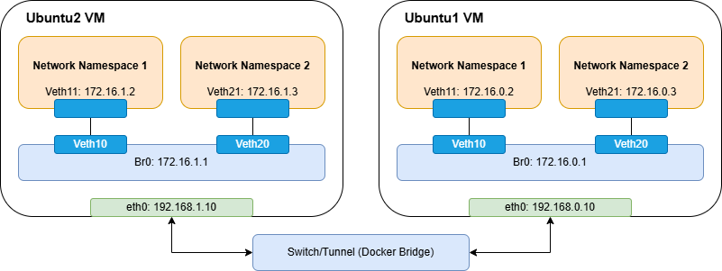

# Docker‑Based Dual‑Ubuntu Network Namespace Demo
This project simulates two Ubuntu “VMs” (`ubuntu1` and `ubuntu2`) connected by a Docker bridge. Each container creates two Linux network namespaces (NS1, NS2), attaches them to an internal bridge (`br0`), and then routes between the namespaces of both containers.



---

## Prerequisites
- Docker installed and running (tested on Docker Engine ≥ 20.10).  
- Basic familiarity with `docker run`, `docker exec`, and Linux networking (`ip`, `ip netns`, `bridge`).  
- Host machine able to allocate `192.168.0.0/24` for Docker (no conflicts).  

---

## Steps
1. Create a folder (e.g. `netns-demo/`) and save the following Dockerfile as `Dockerfile`:
    ```dockerfile
    FROM ubuntu:latest

    ENV DEBIAN_FRONTEND=noninteractive

    RUN apt-get update && apt-get install -y --no-install-recommends \
        curl \
        wget \
        iputils-ping \
        net-tools \
        iproute2 \
        vim \
        less \
        ca-certificates \
        gnupg \
        && rm -rf /var/lib/apt/lists/*

    CMD [ "bash" ]
    ```

2. From that folder, build the image
    ```bash
    docker build -t ubuntu-with-utils .
    ```

3. Create a Docker Bridge Network
    We need a user-defined bridge so we can assign static IPs (`192.168.0.10` and `192.168.0.11`) to our two containers. On the host, run:

    ```bash
    docker network create \
    --driver=bridge \
    --subnet=192.168.0.0/24 \
    my-bridge-net
    ```

4. Launch the Two Ubuntu Containers
    ```bash
    # Run ubuntu1
    docker run -it \
    --name ubuntu1 \
    --privileged \
    --network my-bridge-net \
    --ip 192.168.0.10 \
    ubuntu-with-utils \
    bash

    # In new terminal, run ubuntu2 
    docker run -it \
    --name ubuntu2 \
    --privileged \
    --network my-bridge-net \
    --ip 192.168.0.11 \
    ubuntu-with-utils \
    bash
    ```

5. Copy & Run the Setup Scripts
    There are two separate scripts: one for `ubuntu1` (container IP `192.168.0.10`) and one for `ubuntu2` (container IP `192.168.0.11`). Each script:
    - Creates two network namespaces (NS1, NS2).
    - Builds a Linux bridge (br0) and two veth pairs connecting those namespaces.
    - Assigns IP addresses and brings up all interfaces.
    - Enables IPv4 forwarding + sets iptables to ACCEPT FORWARD.
    - Installs a host‐level route that points to the other container’s Docker IP.

    Now, copy `setup-ubuntu1.sh` and run it inside `ubuntu1`. Next, copy `setup-ubuntu2.sh` and run it inside `ubuntu2`.

6. Test and Verify Connectivity
    Once both scripts have completed successfully, you can test all the links from inside `ubuntu1`. If all pings succeed, your dual-container, multi-namespace network is fully operational.

7. Cleanup
    When you’re done and want to tear everything down, from your host run:
    ```bash
    docker rm -f ubuntu1 ubuntu2
    docker network rm my-bridge-net
    ```